# NERO — Architecture Deep Dive

> **Neural Executive & Reasoning Orchestrator.** This document explains every part of the system: what it does, how it works, and — most importantly — *why it's built that way*. Diagrams are Mermaid and render natively on GitHub.

---

## Table of contents

1. [The 30-second picture](#1-the-30-second-picture)
2. [Full system map](#2-full-system-map)
3. [Lifecycle of a run](#3-lifecycle-of-a-run)
4. [The agents](#4-the-agents)
   - [VERGIL — planner](#41-vergil--planner)
   - [NERO — executor](#42-nero--executor)
   - [LADY — critic](#43-lady--critic)
   - [TRISH — memory](#44-trish--memory)
5. [The Reflexion loop](#5-the-reflexion-loop)
6. [YAMATO — the MCP gateway](#6-yamato--the-mcp-gateway)
7. [The arsenal (tool servers)](#7-the-arsenal-tool-servers)
8. [Guardrails](#8-guardrails)
9. [Streaming architecture](#9-streaming-architecture)
10. [The console UI](#10-the-console-ui)
11. [REBELLION — the eval suite](#11-rebellion--the-eval-suite)
12. [Provider abstraction](#12-provider-abstraction)
13. [Deployment topology](#13-deployment-topology)
14. [Design decisions & trade-offs](#14-design-decisions--trade-offs)
15. [File-by-file map](#15-file-by-file-map)

---

## 1. The 30-second picture

NERO takes a goal, **plans** it into schema-validated steps, **executes** the plan with real tools over the Model Context Protocol, **judges** its own answer with a rubric-driven LLM critic, and — if the judgment fails — **retries with a stored reflection** about what went wrong. Every state transition streams to a live console. The whole loop runs under a hard token budget and an attempt ceiling, so it can never spiral.

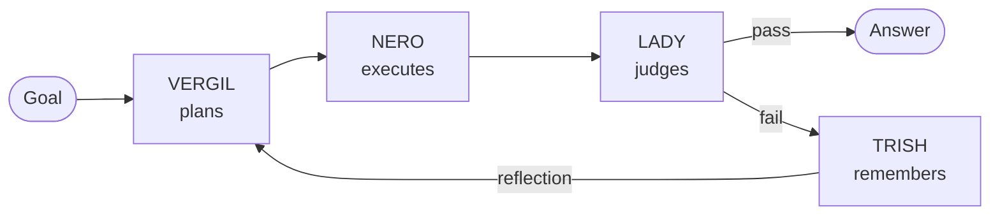

The one-sentence thesis: **tool-calling is table stakes; the product here is the hard parts** — bounded loops, recovery from bad tool output, honest measurement.

---

## 2. Full system map

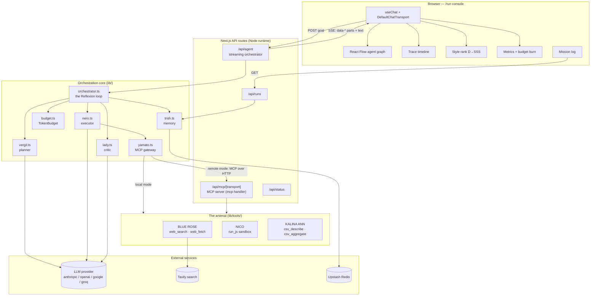

Three properties worth noticing:

- **Tools are defined exactly once** (`lib/tools/`) and consumed two ways: in-process by the executor, and over the wire as a genuine MCP server. No duplicated logic.
- **The orchestrator is UI-agnostic.** It emits events through a sink interface — the same loop powers the streaming web console and the CLI eval harness.
- **Every external dependency is optional.** No Tavily key → search degrades honestly. No Redis → in-memory fallback. No specific provider → switch with one env var.

---

## 3. Lifecycle of a run

What happens between typing a goal and seeing the rank slam onto the screen:

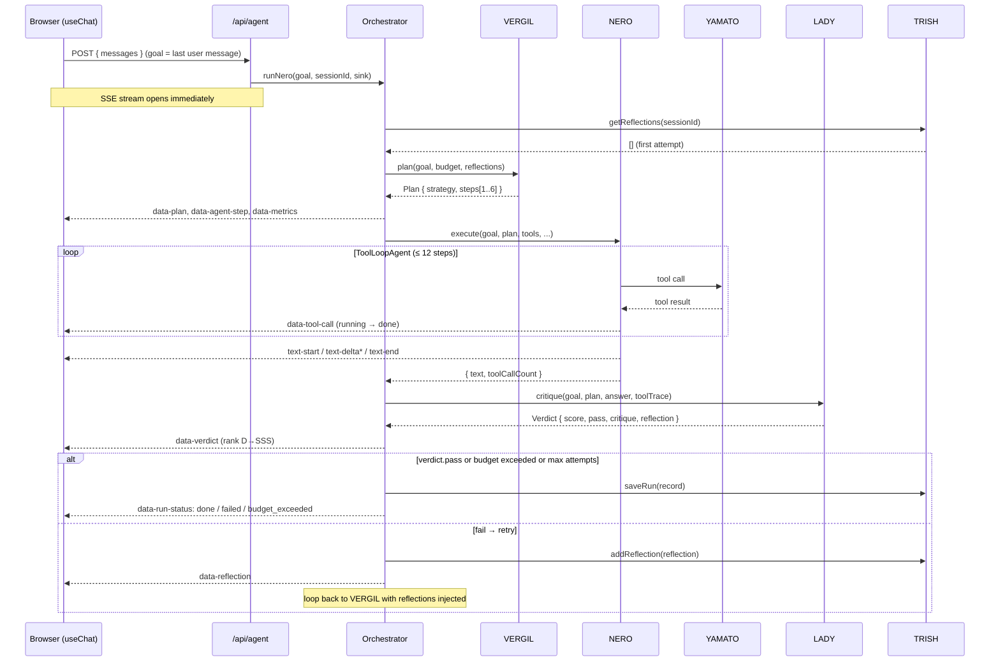

Key detail: the HTTP response starts streaming **before any model call** — Vercel functions are killed if they sit silent, and the user sees the plan materialize in real time instead of staring at a spinner.

---

## 4. The agents

The design follows Anthropic's "Building Effective Agents" guidance: simple, composable patterns over frameworks. Each agent is a small file with one job and one structured output.

### 4.1 VERGIL — planner

**File:** `lib/agents/vergil.ts` · **Primitive:** `generateObject` + Zod `PlanSchema`

VERGIL decomposes the goal into an ordered, minimal set of steps — then steps back. It never executes anything.

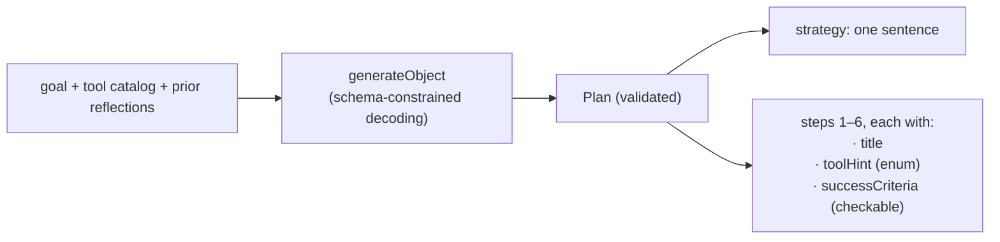

**Why schema-validated planning matters:**

- `generateObject` constrains the model to emit JSON matching `PlanSchema` — the plan **cannot** be malformed prose. Downstream code never parses free text.
- `toolHint` is a Zod **enum of actual tool names** (+`none`). The planner physically cannot plan around a tool that doesn't exist — a whole hallucination class deleted at the type level.
- Every step requires a **concrete success criterion** ("the exact integer is stated", not "the answer is good"). LADY judges against these later, closing the plan→verify loop.
- The prompt caps plans at 1–3 steps unless genuinely necessary. Over-decomposition is a real failure mode: more steps = more tokens = more places to go wrong.

On retry attempts, prior reflections are injected into the planning prompt — so a failed run doesn't just retry harder, it **re-plans differently**.

### 4.2 NERO — executor

**File:** `lib/agents/nero.ts` · **Primitive:** `ToolLoopAgent`

The tactical workhorse. Receives the plan as instructions and runs the AI SDK's production tool loop: call model → model requests tool → execute tool → append result → repeat.

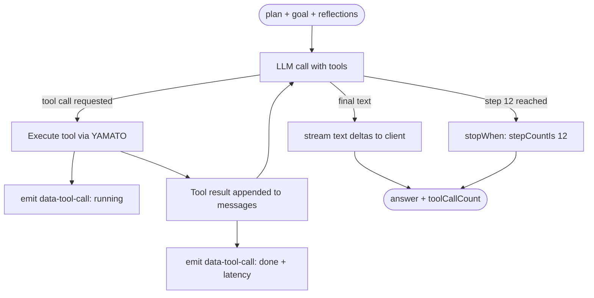

**The details that matter:**

- **`stopWhen: stepCountIs(12)`** — the first of three nested loop bounds (steps → attempts → tokens). An agent without a step cap is an infinite loop with an API bill.
- **Lifecycle callbacks** (`onToolExecutionStart` / `onToolExecutionEnd`) capture every tool invocation with wall-clock latency, feeding both the live UI and the tool trace LADY will judge.
- **Instructions encode epistemic rules**, not just the plan: *a tool returning `ok:false` is a signal to adapt, not to invent data* and *never fabricate URLs, numbers or search results*. The executor is explicitly told how to fail.
- The executor can be a **cheaper/faster model** than the planner or critic (`NERO_EXECUTOR_MODEL`) — tool orchestration is more mechanical than planning or judging.

### 4.3 LADY — critic

**File:** `lib/agents/lady.ts` · **Primitive:** `generateObject` + Zod `VerdictSchema`

The external verification signal. LADY sees the goal, the plan's success criteria, the **complete tool trace** (inputs and outputs), and the final answer — then scores three axes from 0–100:

| Criterion | Question it answers |
|---|---|
| `task_completion` | Does the answer fully, correctly accomplish the goal? |
| `tool_usage` | Were the right tools chosen and their outputs used faithfully? |
| `grounding` | Is every factual claim supported by tool output, or flagged as model knowledge? |

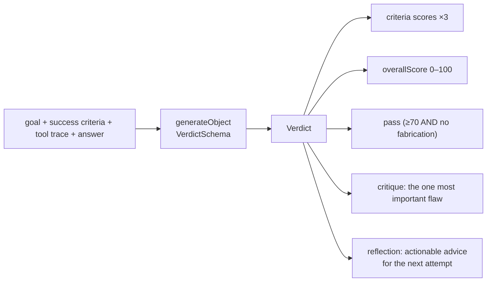

**Why this is the load-bearing component:** research shows LLMs largely *cannot* self-correct reasoning without external feedback — naive "try again, but better" retry loops can make answers **worse** (Huang et al., ICLR 2024, arXiv:2310.01798). Reflexion-style self-correction works when the reflection is grounded in a real verification signal (Shinn et al., NeurIPS 2023, arXiv:2303.11366). LADY is that signal:

- She judges against the **plan's own success criteria** — the contract VERGIL wrote.
- She reads the **actual tool trace**, so "the answer says 42 but no tool ever produced 42" is a catchable grounding failure.
- Her rubric explicitly states: *a plausible-sounding but unverified answer is a fail, not an A.* This is the anti-sycophancy clause — the critic is calibrated to be strict.
- The rank mapping (D→SSS) is presentation; the pass gate is `overallScore ≥ 70 AND no fabrication`.

### 4.4 TRISH — memory

**File:** `lib/memory/trish.ts` · **Backend:** Upstash Redis, with an in-process `Map` fallback

Two memory tiers with different lifetimes:

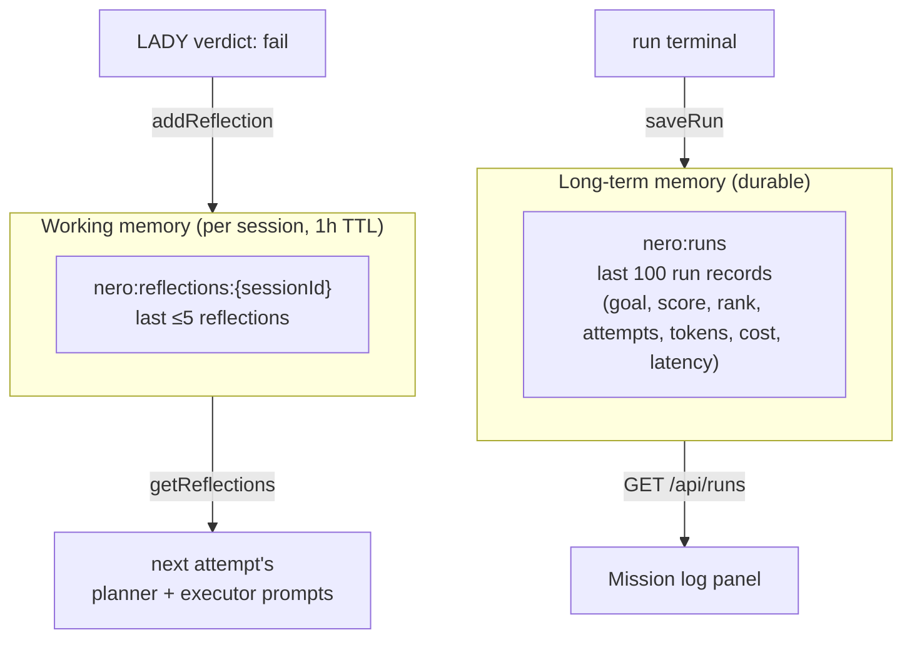

**Design choices:**

- **Reflections are capped at 5 per session.** Memory hygiene is part of the Reflexion recipe — an unbounded reflection list bloats prompts and eventually poisons them with stale advice.
- **1-hour TTL on working memory** — reflections are advice about *this* goal, not durable knowledge.
- **The fallback is honest.** Without Redis, memory lives in the serverless instance and survives only while it's warm. The console's `MEMORY: VOLATILE` chip tells you which mode you're in — the system never pretends to be more durable than it is.

---

## 5. The Reflexion loop

The orchestrator (`lib/agents/orchestrator.ts`) wires everything into a bounded state machine:

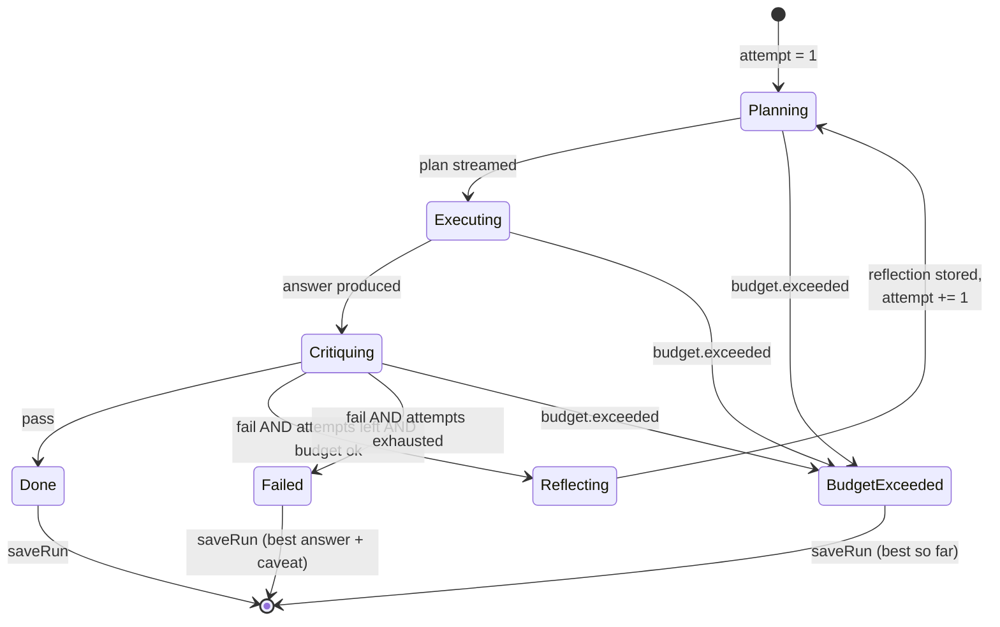

Three deliberate behaviors:

1. **Budget is checked after every phase**, not just per attempt — a run can stop mid-loop the moment it crosses the cap.
2. **Failure still returns the answer.** A failed run ships the best answer *with LADY's critique attached as a visible caveat* — more honest than an error page, more useful than silence.
3. **The reflection reshapes the next attempt at both levels**: VERGIL re-plans with it, and NERO executes with it. A failed approach isn't retried verbatim.

---

## 6. YAMATO — the MCP gateway

**File:** `lib/mcp/yamato.ts`

The executor never imports tools directly — it asks YAMATO for a `ToolSet`. YAMATO has two modes, switched by `YAMATO_MODE`:

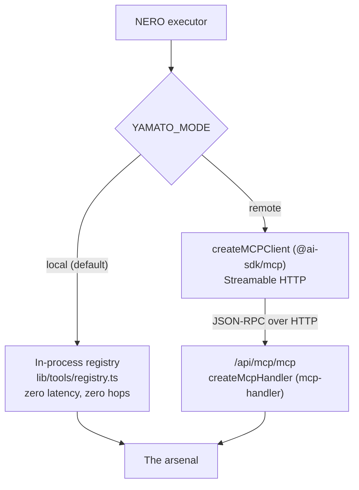

**Why dual-mode instead of picking one:**

- **Local** is the correct engineering default when agent and tools ship in the same deployment — adding an HTTP hop to call your own process is architecture theater.
- **Remote** exists to prove the protocol is real: flip one env var and the exact same run flows through a genuine MCP client → Streamable HTTP → MCP server round-trip. The MCP server is also independently useful — **point Claude Desktop or Cursor at `https://<your-app>/api/mcp/mcp`** and they get NERO's arsenal.
- The route exports `GET`, `POST` **and** `DELETE` — MCP initialize arrives over POST, stream reads over GET; export only POST and clients see empty capabilities (a real-world gotcha).
- `redisUrl` enables Streamable HTTP session resumption across serverless instances; stateless tool calls work without it.

---

## 7. The arsenal (tool servers)

Every tool: Zod `inputSchema` (validates every call the model makes), structured `{ok: true|false}` results (errors are data the agent reasons about, never exceptions that kill the run).

### BLUE ROSE — web reconnaissance (`lib/tools/blue-rose.ts`)

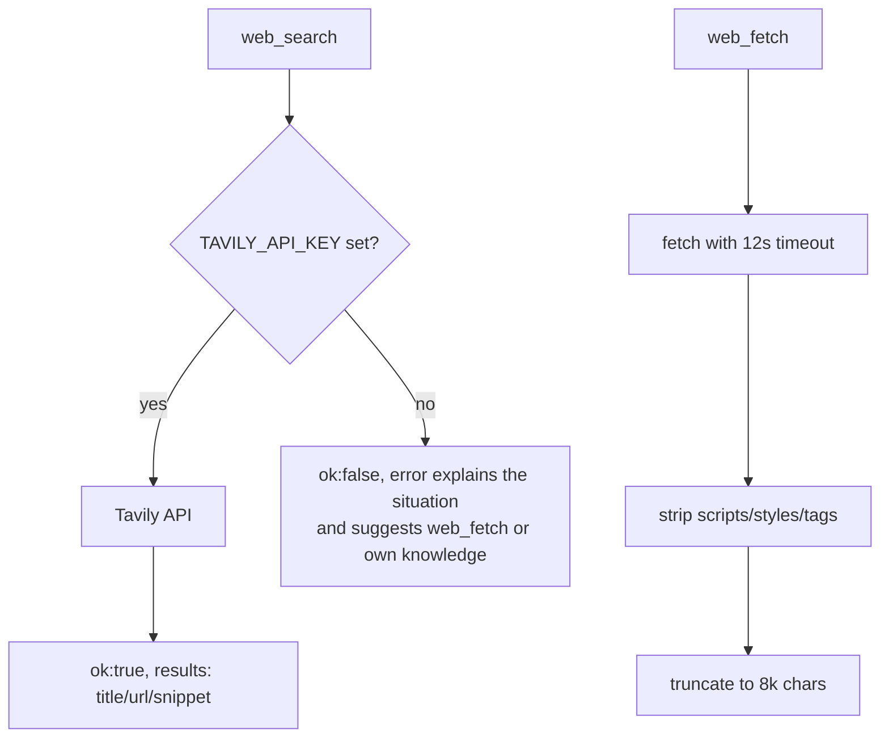

The unconfigured-search path is the interesting part: instead of throwing or hallucinating, the tool returns a **structured explanation the model can route around**. Honest degradation is a feature, not an apology.

### NICO — code sandbox (`lib/tools/nico.ts`)

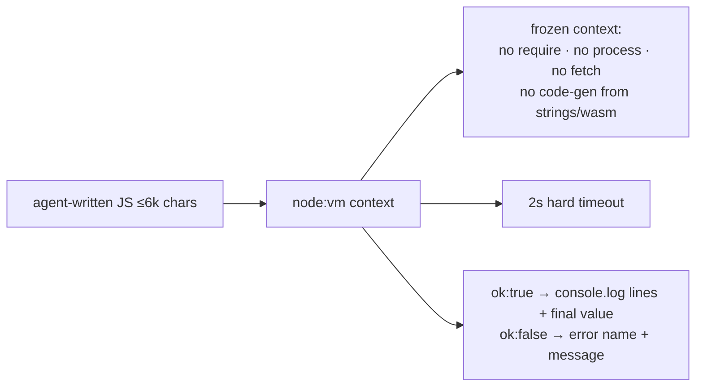

**Honest-by-design:** `node:vm` is **not** a security boundary against a determined adversary, and the code says so in a comment block. It's demo-grade isolation with a documented upgrade path (Vercel Sandbox / E2B) behind the *same tool interface*. Knowing where your sandbox's guarantees end is the senior-level signal.

### KALINA ANN — data analysis (`lib/tools/kalina-ann.ts`)

Pure TypeScript CSV analytics — a hand-rolled quote-aware parser, `csv_describe` (per-column type inference, min/max/mean/median/stddev), `csv_aggregate` (group-by with sum/mean/count/min/max).

Why pure TS instead of "run pandas in the sandbox": **deterministic tools give LADY something exact to verify against.** When the aggregation is computed by real code, "does the answer match the tool output" is a crisp grounding check. The tool description also enforces an anti-hallucination workflow: *always `csv_describe` first so you know the real column names.*

---

## 8. Guardrails

Three nested loop bounds — each one catches what the previous one misses:

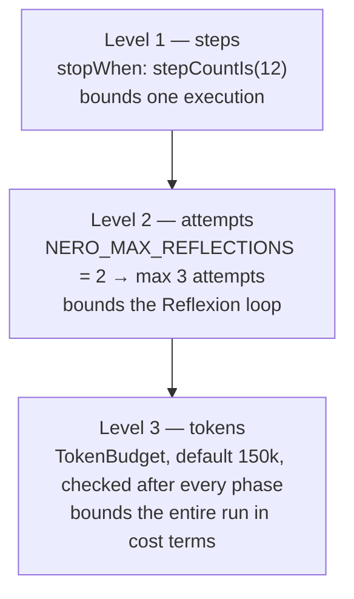

**`TokenBudget`** (`lib/budget.ts`) accumulates usage from **every** LLM call — planner, executor, critic, every attempt. The cost estimate uses a deliberately conservative flat rate ($3/M input, $15/M output) so the dashboard number is an **upper bound**, not marketing.

Why this is non-negotiable: Reflexion-style loops cost roughly **10–30× a single pass**. A public demo without a hard cap is an open invitation to drain your API account. When the budget trips, the run ends gracefully with `budget_exceeded` and returns the best answer so far.

---

## 9. Streaming architecture

The nervous system. The orchestrator emits events through a **sink interface**; the API route implements the sink as typed UI-message-stream writes; the client derives its entire state from the parts.

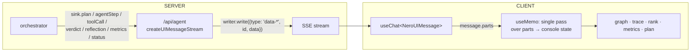

**The typed data parts** (`ai/types.ts`) — the full vocabulary of the stream:

| Part | Carries | ID strategy |
|---|---|---|
| `data-plan` | strategy + steps + attempt | `plan-{attempt}` |
| `data-agent-step` | agent, label, status, detail | `{agent}-{attempt}` |
| `data-tool-call` | name, input, output, latency, status | `tool-{callId}` |
| `data-reflection` | critique + reflection text | `reflection-{attempt}` |
| `data-verdict` | score, rank, pass, criteria | `verdict-{attempt}` |
| `data-metrics` | tokens, cost, latency, budget | `metrics` (fixed) |
| `data-run-status` | phase + human message | `run-status` (fixed) |

Three mechanisms doing the heavy lifting:

1. **ID-based reconciliation.** Writing a part with an existing `id` *updates it in place*. A tool call is written once as `running` and again as `done` with the same id — the UI row and graph node animate through states instead of duplicating. Fixed-id parts (`metrics`) are a single continuously-updating cell.
2. **Fresh text part per attempt.** `sink.resetText()` closes the current text part before each execution attempt, so a retry's answer never concatenates onto the failed one. The client renders the **last** text part.
3. **Full-stack type safety.** `NeroUIMessage = UIMessage<never, NeroDataParts>` means the server cannot write a part shape the client doesn't know, and the client switch over `part.type` is exhaustively typed. Adding a part type is a compile-error-guided tour of exactly the code that must change.

---

## 10. The console UI

**Design system ("Devil Trigger"):** void `#0a0d14` · panel `#101623` · spectral cyan `#5ee1ff` (Nero's Devil Trigger) · crimson `#e1364c` (critic/fail) · ember `#f2b94b` (planner) · arcane violet `#9d7bff` (memory). Type: Chakra Petch (display) / IBM Plex Sans (body) / IBM Plex Mono (data). The geometry is **angular corner cuts** everywhere — a two-layer `clip-path` trick (`CutPanel`), because clip-path eats real CSS borders.

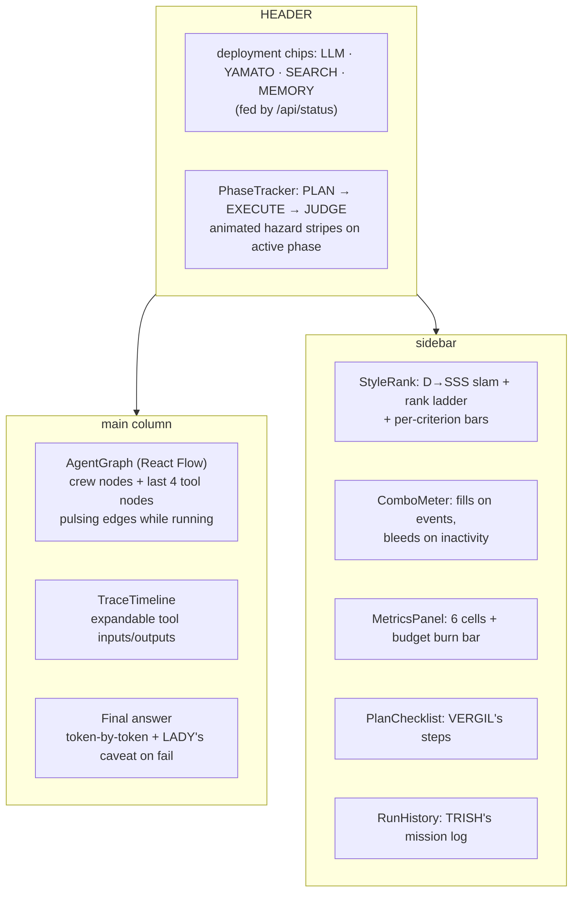

- **Everything is derived state.** No imperative event handling — one `useMemo` folds `message.parts` into the console state. Reconnect or re-render and the UI rebuilds identically from the parts.
- **The signature element is the style rank**: LADY's 0–100 verdict slams in as a DMC rank (D → SSS), the full ladder lighting up beneath it. Theming that *visualizes the eval*, not decoration.
- **The combo meter is honest theater** — it visualizes real event throughput (each streamed part lands a hit; inactivity bleeds it), it just does so with maximum drama.
- Accessibility floor: `prefers-reduced-motion` disables every animation, focus states are visible, progress bars carry ARIA attributes.

---

## 11. REBELLION — the eval suite

**Files:** `lib/evals/suite.ts`, `lib/evals/run.ts`

Twenty tasks, each with a **programmatic ground-truth check** on the final answer — the lift from self-correction is measured against reality, not vibes.

| Category | n | Exercises | Example |
|---|---|---|---|
| compute | 7 | NICO sandbox | "Sum of the digits of 2^100" → must contain `115` |
| data | 5 | KALINA ANN | "Which region has highest revenue?" → `West` + `30,500` |
| reasoning | 4 | tool *restraint* | bat-and-ball → `5` cents (classic intuition trap) |
| web | 4 | BLUE ROSE | "Fetch example.com, report the heading" → `Example Domain` |

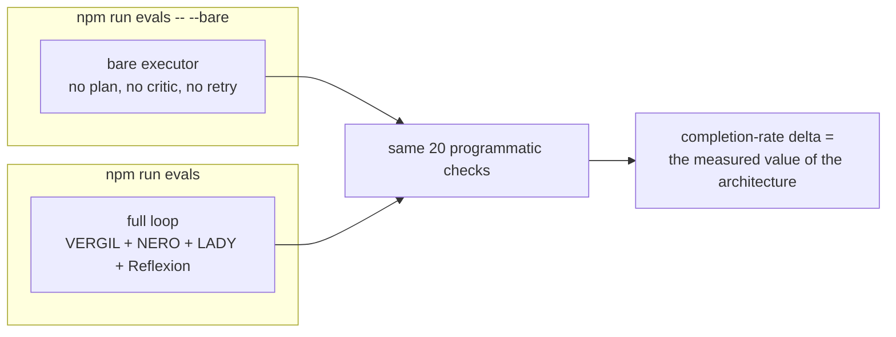

Details that make it a real harness rather than a demo script:

- The **reasoning** category is adversarial in the other direction — questions where eager tool use or pattern-matched intuition gets the wrong answer. It tests that the loop doesn't *over*-engage.
- Checks are regex/substring against ground truth (`102334155`, `27720`, thousand-separator-tolerant patterns) — no LLM grades the eval that validates the LLM loop, avoiding the circular-judge problem.
- The runner reports completion rate, total tokens, and estimated cost per configuration — the README table is meant to be filled with **both** numbers, because publishing the ablation baseline alongside the headline is what makes the headline credible.

---

## 12. Provider abstraction

**File:** `lib/providers.ts`

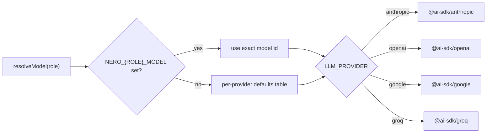

- One env var (`LLM_PROVIDER`) swaps the entire backend; the AI SDK's unified `LanguageModel` interface means zero code changes.
- **Per-role resolution** encodes a real principle: *the critic should never be weaker than the worker* — a judge that misses what the executor missed produces reflections that make things worse. Defaults give the critic the strongest model in each family.
- Env overrides (`NERO_PLANNER_MODEL` etc.) isolate the codebase from provider model-id churn — when model names change, you change an env var, not code.

---

## 13. Deployment topology

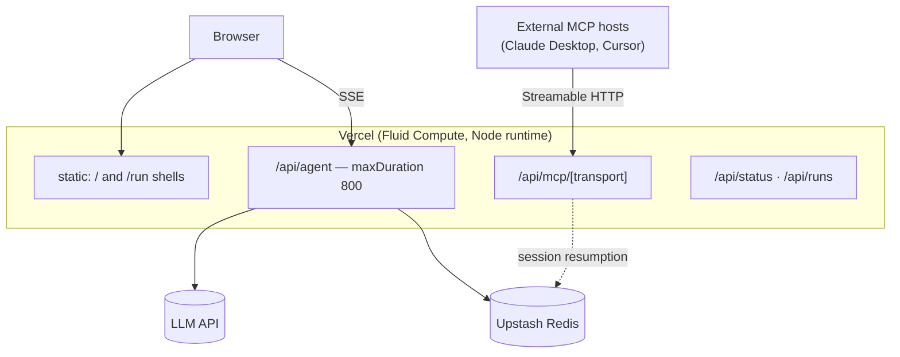

- **Node runtime everywhere** — `node:vm`, mcp-handler, and long durations all rule out Edge (25s hard cap).
- `maxDuration: 800` requires a Pro plan; on Hobby set it to 300 (plenty for demo runs).
- **Early streaming is a survival mechanism**: the response begins before the first model call so the platform never kills a "silent" function mid-run.
- Environment variables are the entire configuration surface — see `.env.example`. The minimum viable deployment is exactly two vars: `LLM_PROVIDER` + one API key.

---

## 14. Design decisions & trade-offs

| Decision | Alternative | Why this way |
|---|---|---|
| Hand-built loop on raw AI SDK | LangGraph / Mastra / CrewAI | Frameworks obscure the prompts and control flow; building the loop demonstrates you understand what's under the abstraction. Anthropic's own guidance: simple composable patterns beat frameworks for most uses. |
| External LLM-as-judge critic | Intrinsic self-critique ("review your answer") | Evidence says intrinsic self-correction without external signal can *degrade* performance. The rubric + tool-trace + success-criteria judge is a genuine external signal. |
| Tools defined once, dual-exposed | Separate MCP server implementation | One source of truth; the MCP route is a thin content-block adapter. Divergence between "the tools the agent uses" and "the tools the MCP server serves" is a bug class deleted. |
| `node:vm` sandbox, loudly documented | Ship Firecracker/E2B integration | Right-sized for a portfolio demo; the honest limitation note + identical-interface upgrade path is worth more as a signal than silent complexity. |
| Structured `ok:false` tool errors | Throw exceptions | An exception kills the run; a structured error is context the model can reason about and route around. |
| Fresh text part per attempt | Append to one text stream | A retry's answer must replace, not concatenate with, the failed attempt's answer. |
| Conservative flat-rate cost estimate | Per-provider price tables | An upper bound that's simple and honest beats a precise number that's stale the day a provider changes pricing. |
| Programmatic eval checks | LLM-graded evals | The harness that validates the LLM loop shouldn't itself be an LLM opinion — circular judging. |

---

## 15. File-by-file map

```
nero/
├── PLAN.md                     # the build plan this repo was executed from
├── ARCHITECTURE.md             # this document
├── README.md                   # quickstart, crew table, eval table, deploy
├── vercel.json                 # maxDuration 800 for app/api/**
├── .env.example                # the full configuration surface
│
├── ai/
│   └── types.ts                # NeroDataParts, NeroUIMessage, scoreToRank (D→SSS)
│
├── lib/
│   ├── providers.ts            # LLM_PROVIDER switch + per-role model resolution
│   ├── budget.ts               # TokenBudget (hard cap) + MAX_REFLECTIONS
│   ├── agents/
│   │   ├── schemas.ts          # PlanSchema + VerdictSchema (Zod)
│   │   ├── vergil.ts           # planner  — generateObject
│   │   ├── nero.ts             # executor — ToolLoopAgent + event callbacks
│   │   ├── lady.ts             # critic   — rubric LLM-as-judge
│   │   └── orchestrator.ts     # the Reflexion state machine + sink interface
│   ├── mcp/
│   │   └── yamato.ts           # dual-mode tool gateway (local / remote MCP client)
│   ├── memory/
│   │   └── trish.ts            # reflections + run log (Upstash / in-memory)
│   ├── tools/
│   │   ├── registry.ts         # ARSENAL — single source of truth + metadata
│   │   ├── blue-rose.ts        # web_search (Tavily) + web_fetch
│   │   ├── nico.ts             # run_js — vm sandbox, 2s cap
│   │   └── kalina-ann.ts       # csv_describe + csv_aggregate
│   └── evals/
│       ├── suite.ts            # 20 tasks × programmatic checks (REBELLION)
│       └── run.ts              # CLI runner: full loop vs --bare ablation
│
├── app/
│   ├── layout.tsx              # fonts (Chakra Petch / IBM Plex) + shell
│   ├── globals.css             # Devil Trigger tokens, corner cuts, animations
│   ├── page.tsx                # landing: glitch hero, crew, arsenal
│   ├── run/page.tsx            # the console — all state derived from parts
│   └── api/
│       ├── agent/route.ts      # streaming orchestrator endpoint
│       ├── mcp/[transport]/route.ts  # the arsenal as a real MCP server
│       ├── status/route.ts     # deployment config for header chips
│       └── runs/route.ts       # TRISH's mission log
│
└── components/
    ├── ui/CutPanel.tsx         # two-layer clip-path corner-cut panel
    ├── graph/AgentGraph.tsx    # React Flow crew + tool nodes, pulsing edges
    └── console/
        ├── StyleRank.tsx       # the signature: D→SSS rank slam + ladder
        ├── PhaseTracker.tsx    # PLAN → EXECUTE → JUDGE stepper
        ├── ComboMeter.tsx      # event-throughput gauge, DMC style
        ├── TraceTimeline.tsx   # expandable step/tool/reflection log
        ├── MetricsPanel.tsx    # tokens · cost · latency · budget burn
        ├── PlanChecklist.tsx   # VERGIL's plan as a mission checklist
        └── RunHistory.tsx      # TRISH's long-term memory, ranked
```

---

*Built as a portfolio piece. The interesting parts are the boring parts: the budget that stops the loop, the critic that refuses to be impressed, and the eval suite that tells you whether any of it actually helped.*
